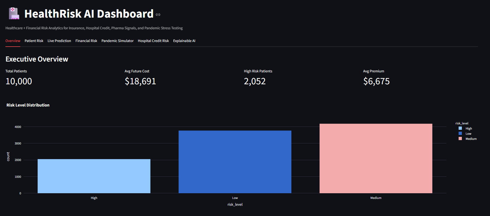
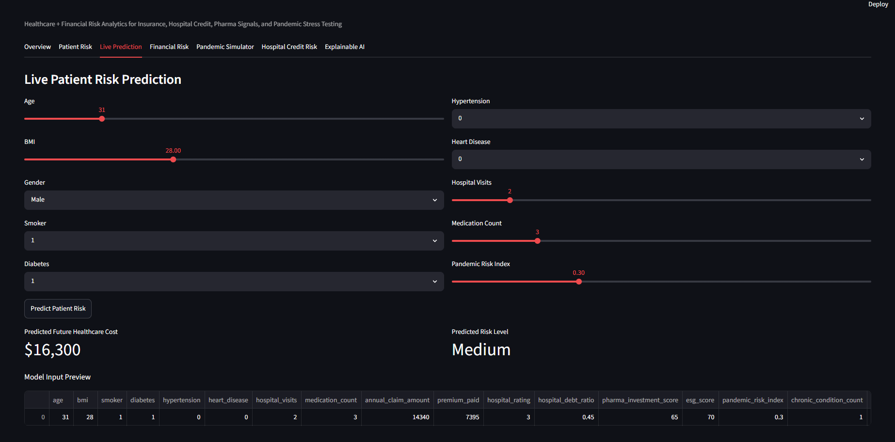
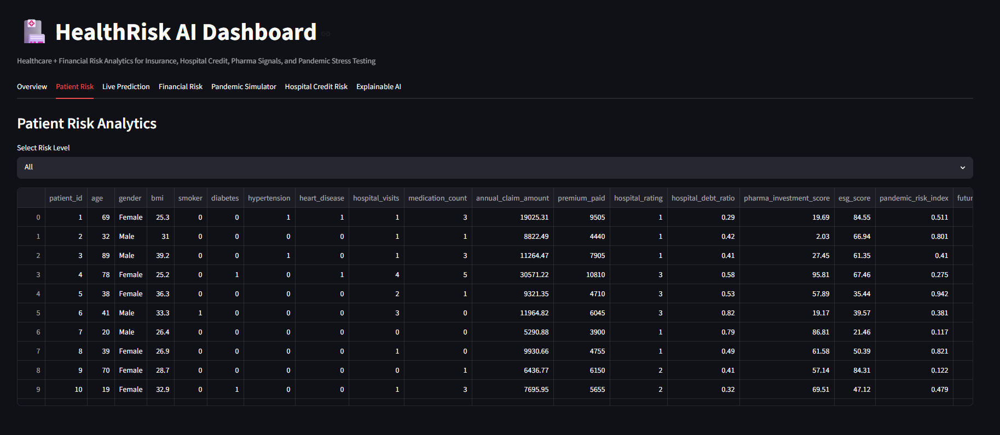
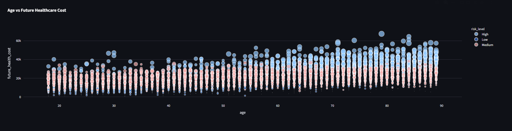
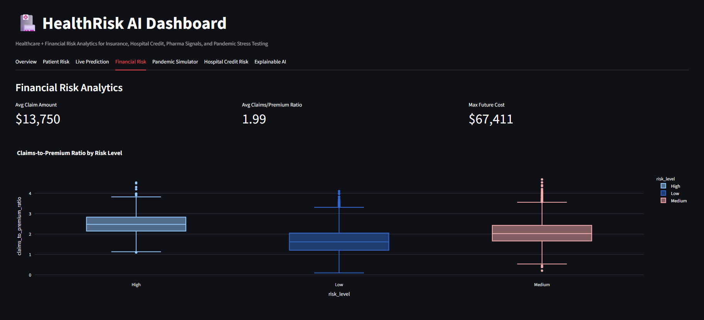
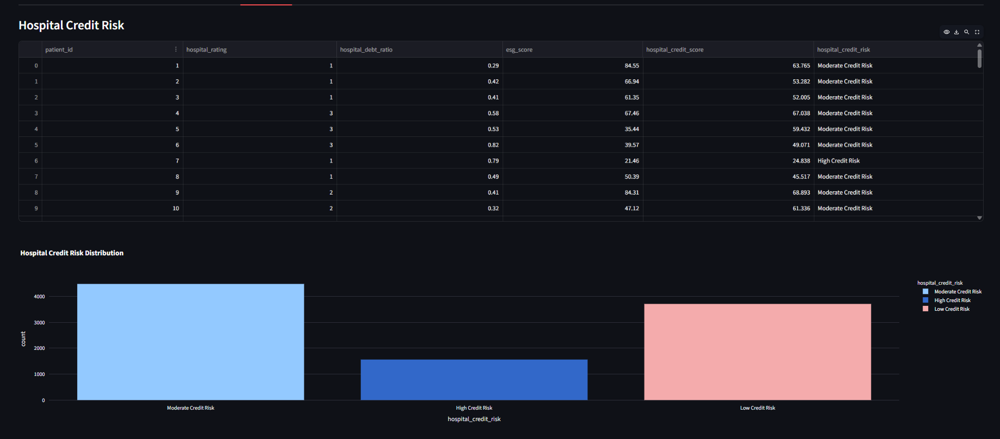
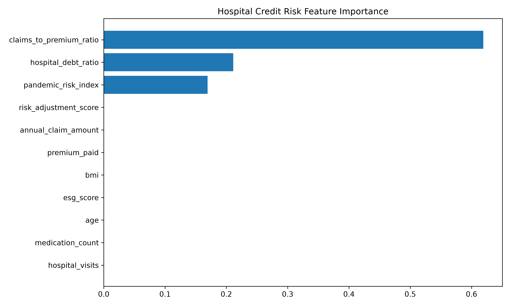
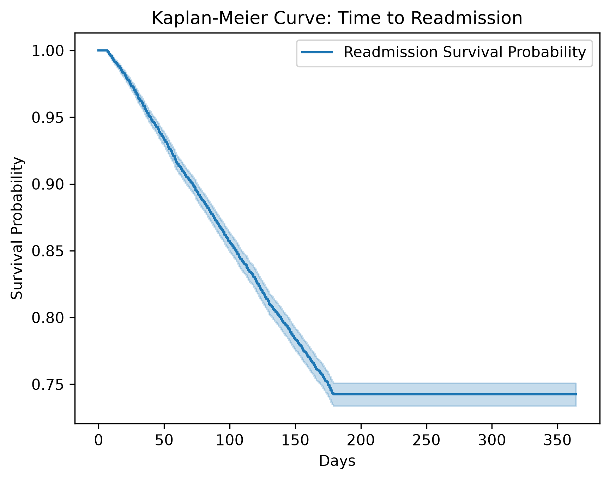

# 🏥 HealthRisk AI
### Enterprise Healthcare Risk Intelligence & Financial Analytics Platform

An end-to-end AI-powered healthcare intelligence platform that combines predictive machine learning, explainable AI (XAI), healthcare analytics, financial risk modeling, pharmaceutical portfolio analysis, and interactive decision-support dashboards.

The platform was designed using production-oriented software engineering practices including modular architecture, automated testing, Docker containerization, and interactive Streamlit deployment.

---

<p align="center">


</p>

# Project Highlights

HealthRisk AI integrates multiple AI disciplines into a unified healthcare analytics platform.

### Machine Learning
- Healthcare Cost Prediction
- Patient Risk Classification
- XGBoost
- LightGBM
- Stacking Ensemble Learning

### Explainable AI (XAI)

- SHAP Feature Importance
- SHAP Summary Plot
- Partial Dependence Plots
- Individual Conditional Expectation (ICE)
- Counterfactual Explanations
- Model Cards
- Regulatory Mapping

### Healthcare Analytics

- Clinical NLP
- Rule-Based Clinical Entity Recognition
- Patient Graph Analytics
- Kaplan-Meier Survival Analysis
- Cox Proportional Hazards Model
- Readmission Risk Prediction

### Insurance Analytics

- Loss Ratio
- Combined Ratio
- IBNR Reserve Estimation
- Claims Forecasting
- Premium Recommendation
- Risk Adjustment
- Member Segmentation

### Hospital Credit Risk

- Probability of Default (PD)
- Logistic Regression
- Gradient Boosting
- ROC-AUC Evaluation
- Feature Importance
- Early Warning Indicators
- Bond Spread Prediction

### Pharmaceutical Analytics

- Clinical Trial Pipeline Analytics
- Phase Success Probability
- Patent Cliff Analysis
- Risk-adjusted Net Present Value (rNPV)
- Portfolio Optimization

### Simulation Engine

- Quarterly Healthcare Simulation
- Scenario-Based Risk Analysis
- Portfolio Impact Modeling
- AI Recommendations
- Historical Replay
- 1000-Point Scoring Framework

---

# Platform Architecture

```
                 Patient Data
                      │
                      ▼
           Feature Engineering
                      │
                      ▼
            Machine Learning Models
                      │
        ┌─────────────┼──────────────┐
        ▼             ▼              ▼
 Explainable AI   Financial AI   Healthcare AI
        │             │              │
        └─────────────┼──────────────┘
                      ▼
          Simulation & Decision Engine
                      │
                      ▼
          Interactive Streamlit Dashboard
```

---

# Technology Stack

## Languages

- Python
- SQL

## Machine Learning

- Scikit-learn
- XGBoost
- LightGBM

## Explainable AI

- SHAP

## Healthcare Analytics

- Lifelines
- NetworkX

## Data Processing

- Pandas
- NumPy

## Visualization

- Plotly
- Matplotlib

## Dashboard

- Streamlit

## Deployment

- Docker

## Testing

- PyTest

---

# Repository Structure

```
HealthRisk-ai/

├── app/
│   └── streamlit_app.py
│
├── financial/
│   ├── insurance.py
│   ├── hospital_credit.py
│   └── pharma.py
│
├── healthcare/
│   ├── clinical_nlp.py
│   └── survival_analysis.py
│
├── graph_ai/
│   └── patient_graph.py
│
├── simulation/
│   └── scenario_engine.py
│
├── explainability/
│
├── models/
│
├── reports/
│
├── data/
│   ├── raw/
│   └── processed/
│
├── notebooks/
│
├── tests/
│
├── Dockerfile
├── docker-compose.yml
├── requirements.txt
└── README.md
```

---

# Dashboard Modules

- Executive Dashboard
- Patient Prediction
- Insurance Analytics
- Hospital Credit Risk
- Pharmaceutical Analytics
- Clinical NLP
- Survival Analysis
- Graph Analytics
- Simulation Lab
- Explainable AI

---
# 📸 Dashboard Preview

## Executive Dashboard



---

## Live Patient Prediction



---

## Patient Risk Analysis

| Patient Risk | Patient Risk (Alternative) |
|---------------|---------------------------|
|  |  |

---

## Insurance & Financial Analytics



---

## Hospital Credit Risk



---

## Pandemic Simulation


# Model Performance

# 📈 Model Insights

## Hospital Credit Risk Feature Importance



---

## Kaplan-Meier Survival Analysis



## Healthcare Cost Prediction

- XGBoost Regressor
- LightGBM Regressor
- Stacking Ensemble

## Hospital Credit Risk

| Model | ROC-AUC |
|--------|---------|
| Logistic Regression | **0.9824** |
| Gradient Boosting | **0.9997** |

---

# Software Engineering Practices

- Modular Architecture
- Object-Oriented Design
- Feature Engineering Pipeline
- Explainable AI Integration
- Automated Unit Testing
- Docker Containerization
- Production-Oriented Project Structure

---

# Unit Testing

Core modules validated using **PyTest**.

```
9 Tests Passed
```

Modules Covered

- Insurance Analytics
- Clinical NLP
- Graph Analytics
- Pharmaceutical Analytics
- Simulation Engine

---

# Installation

Clone the repository

```bash
git clone https://github.com/YOUR_USERNAME/HealthRisk-ai.git
```

Install dependencies

```bash
pip install -r requirements.txt
```

Launch the dashboard

```bash
streamlit run app/streamlit_app.py
```

---

# Docker

Build

```bash
docker compose build
```

Run

```bash
docker compose up
```

Application

```
http://localhost:8501
```

---

# Future Enhancements

- ClinicalBERT Integration
- DeepSurv
- Graph Neural Networks
- FHIR Integration
- MLflow Model Registry
- Cloud Deployment
- CI/CD Pipeline

---

# Author

## Mirza Sharif Baig

**Data Scientist | Machine Learning Engineer | AI Researcher**

📍 Hyderabad, India

📧 mirzashareef11@gmail.com

LinkedIn: *(https://www.linkedin.com/in/mirzasharifbaig/)*

GitHub: *(https://github.com/Codewithmirzabaig)*

---

## License

This project is intended for educational, research, and portfolio purposes.

---

⭐ If you found this project interesting, consider giving the repository a star.